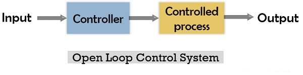
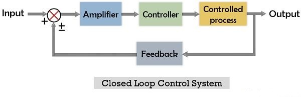
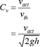
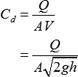
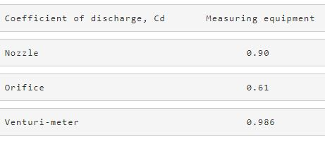
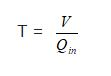

## Control System
Definition: A combination of various elements connected as a unit to direct or regulate itself or any other system in order to provide a specific output is known as a Control system. We know controlling is basically known as the act of regulating or directing.

So control system is used to direct the functioning of a physical system to carry out the desired objective.

For example, from a television system, refrigerator, air conditioner, to automobiles and satellites everything needs a proper controlling to provide the output for which it is designed. Thus all these are control systems.

## Need for a Control System
Control systems are considered as one of the major aspects of our growing technology. Every sector of the industry is linked with the control system in some or the other way.

Like in space technology, power system, transportation system, robotics, machine tool controlling etc., everything needs controlling. So these are basically control systems.

These basically provide the desired responses or application when proper controlling is provided to them.

It is noteworthy here that the input and output of a control system must have appropriate mathematical relationship between them. When there exists linear proportionality between input and output of the system then it is known as a linear control system, otherwise a non-linear system.

## Components of a Control System
Majorly the control system is divided into two major domains: 1. Controlled process: The part of the system which requires controlling is known as a controlled process or plant. 2. Controller: The internal or external element of the system that controls the process is known as the controller.

Further, some other aspects are as follows:

* Input: For every system to provide a specific result, some excitation signal must be provided. This signal is usually given through an external source. So, the externally provided signal for the desired operation is known as input.
* Output: The overall response of the system achieved after application of the input is known as output.
* Disturbances: Sometimes even on providing required input, the system fails to generate the desired output. So the signal that causes variation in the desired output is known as disturbances.

Now, disturbances can be of two types depending on its origin. If the disturbance is generated from the system itself then it is known as internal disturbances. While if the disturbance is generated from somewhere outside the system and unknowingly acting as another input to the system causing an adverse effect on the output. Then it is known as external disturbances.

## Types of Control System
These are majorly classified on the basis of whether the output is involved in controlling action or not.

### 1. Open Loop Control System
In the open-loop system, the applied input or the controlling factor is independent of the system output. Open-loop control system is sometimes termed as a non-feedback system. This is so because no comparison is done between input and output of the system for controlling actions. The figure below represents the block diagram of the open-loop system:

Example: Immersion rod

An immersion rod is used for heating of water. When the input is provided i.e., the external supply is given then the rod starts heating the water. But there is no way provided by which the rod can sense the required level of heating i.e., feedback is not present.

Thus it is an example of an open-loop control system.

### 2. Closed-Loop Control System
In a closed-loop system, the applied input or controlling factor depends on the output of the system. It is also known as feedback control system because in such systems comparison between input and achieved output is done to get the desired output signal.

Let us have a look at the block diagram of the closed-loop system:

Example: Air conditioners

Air conditioners are used for regulating the temperature of a room. So these control systems make use of thermostats as a feedback unit.

The actual temperature of the room is first measured and accordingly the temperature is adjusted to get the desired value of room temperature. Features

1) Sensitivity: Sensitivity is the ability to show instant variation in output whenever there exists any change in input. There are external parameters like temperature change or other atmospheric conditions that hinder the actual performance of the system. So a control system must be sensitive only to the actually applied input and not to other external parameters.

2) Stability: The system must be stable while providing the output without showing fluctuation with time.

3) Bandwidth: The permissible frequency range of the system specifies its bandwidth. And so to have a good frequency response the system must possess high bandwidth.

4) Noise: Unwanted signals that hinders the performance of the system adversely is known as noise. A good control system must show the least susceptibility towards the noise.

5) Accuracy: The system must produce accurate output, so as to have least chances of error in the achieved output value.

6) Speed: Speed defines the processing time of the system within which the specified output is achieved. So the speed of the system must be high enough to deliver the output timely.

This is all about the basic introduction of the control system.

## Liquid Level Control System

Liquid Level Control System is a system specifically designed to control the level of fluid in tanks. The main aim possessed by these systems is to control the rate with which the pump delivers fluid to the tank and so it can reach the desired level inside the tank.

The purpose of the liquid level system is to maintain a specific level of fluid inside the tank. The liquid level control systems find major applications in industrial processes.

## Working of Liquid Level Systems
The crucial components of the water level control system are as follows:

* Fluid tank: Also known as a storage tank, used to hold the desired amount of fluid.
* Measurement system: Senses the level of the fluid inside the tank.
* Controller: The controller is used to maintain the desired level by starting and stopping the pump when gets information by the measurement system.
* Pump: The water from the source is fed to the tank through the pump when actuated by the controller.

### GPM/GPH Flow based on PVC Pipe Size
## Coefficient of Velocity
The proportion of real speed of the stream, at vena-contract a, to the hypothetical speed is known as the coefficient of speed.

Write the equation for coefficient of velocity.

Here, actual velocity is vact, theoretical velocity is vth, gravity is g, and height is h.

The estimation of Coefficient of speed shifts marginally with the diverse states of the edges of the hole. This esteem is little for sharp-edged openings. For a sharp edged hole, the estimation of Cv increases with the head of water.

## Coefficient of Discharge
Coefficient of discharge is stated as the ratio between the actual flow discharge and theoretical flow discharge. It is also referred to as the ratio of mass flow rate at nozzle's discharge edge to the standard nozzle which enlarges an exact working fluid maintained at the similar initial conditions and pressures.

It has no dimensions and depends directly on the rate of flow and velocity of working fluid. It is symbolized by Cd and its value is different for each fluid depending on the kind of measurement of flow. In nozzle flow measurement, the efficiency of Cd is higher when compared to the flow measurement at the orifice. The discharge coefficient is raised by increasing the overall pressure ratio and reducing the convergence semi angle. Also, the range of Cd is commonly superior in supercritical series.

Express the relation of discharge coefficient

## Properties of coefficient of discharge
* It is a non-dimensional quantity which differs directly as the flow of discharge.
* The value of Cd is high in nozzle measurement of flow, whereas its value is small in orifice measurement of flow.
* It can be increased by lowering the convergent angle in flow measurement. It can also be increased when the pressure of working fluid is enhanced.

Write the Cd value for the following flow measuring equipment as in Table (1).

Total Time required to fill the Tank

